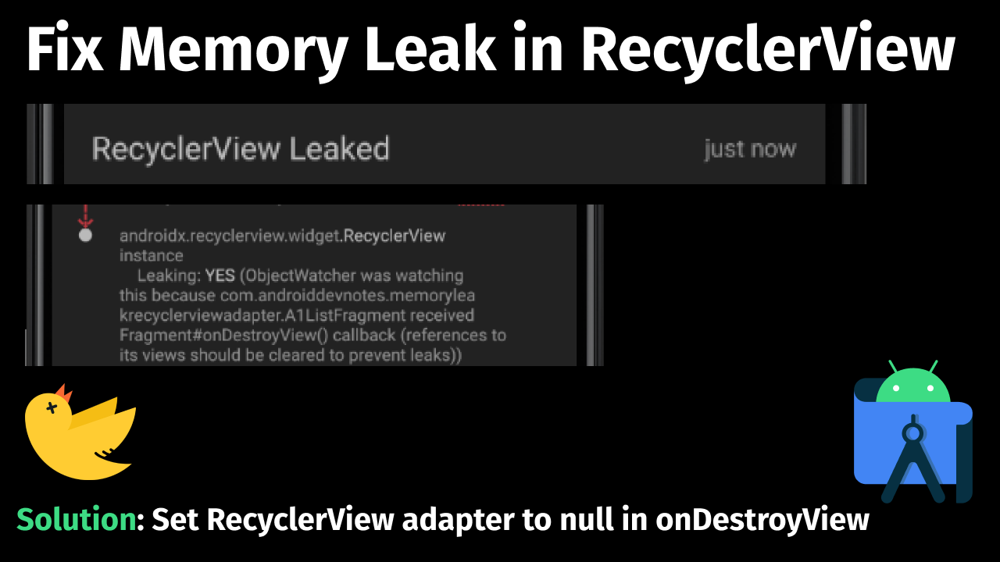

<h1 align="center">Memory Leak RecyclerView Adapter</h1></br>

<p align="center">
Reproducible Sample with Fix
</p>
<br>

<p align="center">
Video Instructions: https://www.youtube.com/c/awesomedevnotes
</p>

<br>

<p align="center">
  <a href="#"></a>
  <a href="https://github.com/androiddevnotes"></a>

</p>

<br>
<p align="center">
</img>
</p>

<br>

## Code

Only the relevant and important code is shown in README. Refer to entire source code for more details.

[A1ListFragment.kt](app/src/main/java/com/androiddevnotes/memoryleakrecyclerviewadapter/A1ListFragment.kt)

```kotlin 

// Important part is wher adapter is set to null in `onDestroyView`

/** Fragment containing RecyclerView */
class A1ListFragment : Fragment(), A1ListRecyclerViewAdapter.OnA1ListItemClickedListener {

    private var _binding: FragmentListA1Binding? = null
    private val binding get() = _binding!!

    // Making RecyclerView adapter nullable so we could set it to null in onDestroyView
    private var a1ListRecyclerViewAdapter: A1ListRecyclerViewAdapter? = null

    override fun onCreateView(
        inflater: LayoutInflater,
        container: ViewGroup?,
        savedInstanceState: Bundle?
    ): View {
        _binding = FragmentListA1Binding.inflate(inflater, container, false)
        return binding.root
    }

    override fun onViewCreated(view: View, savedInstanceState: Bundle?) {
        super.onViewCreated(view, savedInstanceState)
        setup()
    }

    private fun setup() {
        setupRecyclerView()
    }

    private fun setupRecyclerView() {
        a1ListRecyclerViewAdapter = A1ListRecyclerViewAdapter(this)
        binding.a1ListRecyclerView.adapter = a1ListRecyclerViewAdapter
    }

    override fun onDestroyView() {
        // Important to set fields to `null` to prevent memory leaks.
        // We are setting fields to null before `super.onDestroyView()` because official ViewBinding
        // sample, Mozilla Fenix app also do that. I do not know the exact reason.

        a1ListRecyclerViewAdapter = null
        _binding = null
        super.onDestroyView()
    }

    override fun onA1ListItemClicked() {
        findNavController().navigate(R.id.action_a1ListFragment_to_a2DetailFragment)
    }
}

```

<br>

## Dependencies

```groovy
debugImplementation "com.squareup.leakcanary:leakcanary-android:2.7"

// https://github.com/square/leakcanary - To detect memory leaks
```

## :computer: Find us on

<div align="center">
	<a href="https://github.com/androiddevnotes"> GitHub </a> / <a href="https://discord.gg/vBnEhuC"> Discord </a> / <a href="https://twitter.com/androiddevnotes"> Twitter </a> / <a href="https://www.instagram.com/androiddevnotes"> Instagram </a> / <a href="https://www.youtube.com/channel/UCQATLaT0xKkSm-KKVQzpu0Q"> YouTube </a> / <a href="https://medium.com/@androiddevnotes"> Medium </a>
	<br><br>
    </img>
</div>